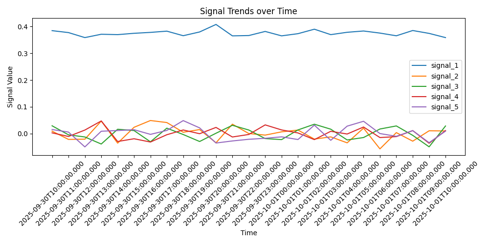
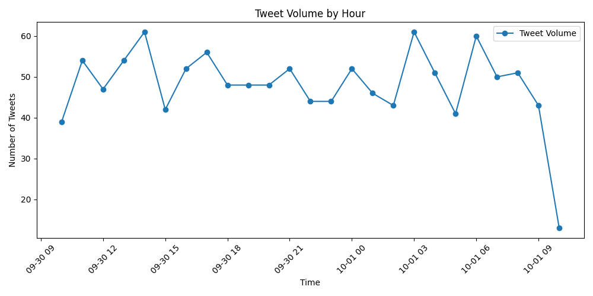
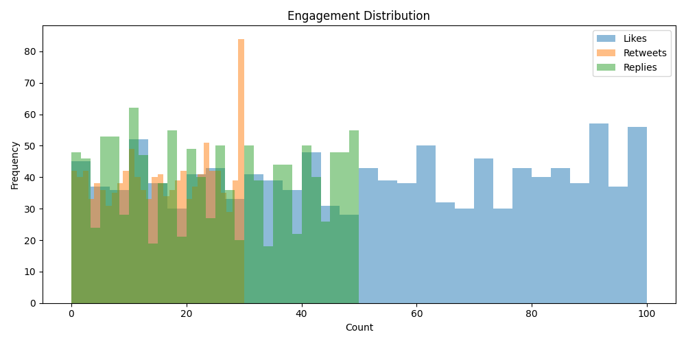

# 📈 QuantBot-Xtractor

**QuantBot-Xtractor** is a Python-based data collection and analysis system for real-time market intelligence.  
It scrapes Twitter/X for Indian stock market discussions, processes the data, and converts it into quantitative signals for trading insights.

---

## 🚀 Features

- **Data Collection**
  - Scrapes tweets using `snscrape` (no paid API, no login required).
  - Focused hashtags: `#nifty50`, `#sensex`, `#banknifty`, `#intraday`, `#nifty`, `#indianstockmarket`.
  - Extracts: username, timestamp, content, mentions, hashtags, likes, replies, retweets.
  - Fallback to cached dataset (`sample_tweets.parquet`) for reproducibility.

- **Data Processing**
  - Cleans and normalizes tweets (deduplication, unicode handling, URL removal).
  - Stored in **Parquet format** for efficiency.

- **Analysis & Insights**
  - Text → numerical features using TF-IDF + dimensionality reduction (SVD).
  - Aggregates signals hourly with **mean + confidence intervals**.
  - Visualizations of tweet activity, engagement, and signals.

- **Engineering Practices**
  - Modular codebase (`scraper.py`, `cleaner.py`, `signals.py`, `plotter.py`).
  - Error handling and fallback mechanisms.
  - Reproducible with sample data provided.

---

## 📂 Project Structure

QuantBot-Xtractor/
|-- requirements.txt
|-- README.md
|-- hashtags.json
|-- main.py
|-- scraper.py
|-- cleaner.py
|-- signals.py
|-- plotter.py
|-- sample_tweets_generator.py
`-- data/
    |-- raw/
    |   `-- sample_tweets.parquet
    |-- processed/
    `-- analysis/


---

## 🛠️ Setup Instructions

1. **Clone the repository**
    ```sh
    git clone https://github.com/0hhh/QuantBot-Xtractor.git
    cd QuantBot-Xtractor
    ```

2. **Install dependencies**
    ```sh
    pip install -r requirements.txt
    ```

3. **(Optional) Generate sample data**
    ```sh
    python sample_tweets_generator.py
    ```

4. **Run the pipeline**
    ```sh
    python main.py
    ```

---

## ✨ Usage

- The pipeline will:
    1. Scrape tweets for each hashtag in [`hashtags.json`](hashtags.json)
    2. Clean and normalize the data
    3. Extract signals and save them as JSON
    4. Generate plots in `data/analysis/`

---

## 📊 Outputs

The pipeline generates the following in `data/`:

- **Raw Tweets** → `data/raw/`
- **Cleaned Tweets** → `data/processed/cleaned.parquet`
- **Signals JSON** → `data/analysis/signals.json`
- **Visualizations**:
  - `signal_plot.png` – Quantitative signals over time
  - `tweet_volume.png` – Tweet volume by hour
  - `engagement_distribution.png` – Distribution of likes/retweets/replies
  - `top_hashtags.png` – Top hashtags in market tweets

---

## 📈 Example Results

### Signal Trends


### Tweet Volume by Hour


### Engagement Distribution


---

## ⚙️ Technical Notes

- If **snscrape fails** (due to Twitter/X backend changes), the system automatically falls back to the cached dataset.  
- This ensures the pipeline **always runs end-to-end**.  
- Adjust `limit` in `main.py` to scrape more tweets (default ~3000+).  

---


## License

This project is for educational and demonstration purposes.

---

## Acknowledgements

- [snscrape](https://github.com/JustAnotherArchivist/snscrape)
- [scikit-learn](https://scikit-learn.org/)
- [matplotlib](https://matplotlib.org/)
